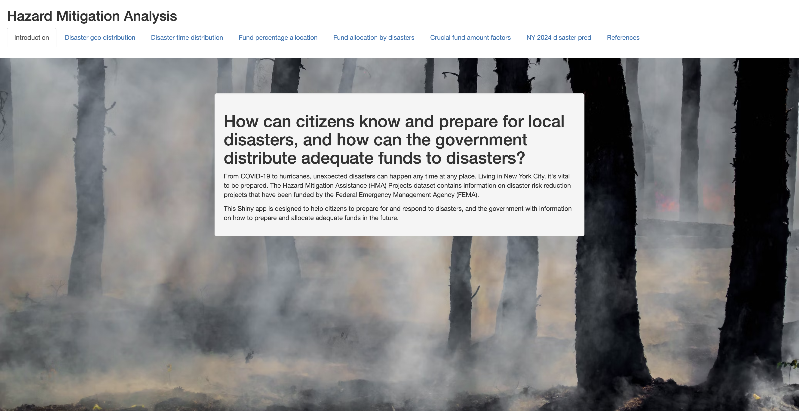

# Project 2: Shiny App Development

### [Project Description](doc/project2_desc.md)

**link for our ShinyApp**: https://drake-wang-2000.shinyapps.io/project2-7/



**Project Summary**: In this project, we utilize the Hazard Mitigation Assistance (HMA) Projects dataset from FEMA to design a Shiny app. This app assists American residents in disaster preparedness and offers insights for the government on future fund allocation and disaster response strategies.

In this second project of GR5243 Applied Data Science, we developed a *Exploratory Data Analysis and Visualization* shiny app using **Federal Emergency Management Agency (FEMA)'s dataset**. In particular, this project delved into the dataset of FEMA's funded projects (financial obligation to grantee) under the Hazard Mitigation Assistance (HMA) grant programs.
 See [Project 2 Description](doc/project2_desc.md) for more details.  

The **learning goals** for this project is:

- business intelligence for data science
- data cleaning
- data visualization
- systems development/design life cycle
- shiny app/shiny server

## Project Title : "Hazard Mitigation Analysis"
Term: Fall 2022
Team #7

**Team members**: Zhaolin Wang, Yoojin Lee, Bessie Wang, Yitian Shen

+ **Source of the Data Set**:

Our main dataset in this project is **OpenFEMA Dataset: Hazard Mitigation Assistance Projects - v3**. This dataset contains funded projects (financial obligation to grantee) under the Hazard Mitigation Assistance (HMA) grant programs. FEMA administers three programs that provide funding for eligible mitigation planning and projects that reduces disaster losses and protect life and property from future disaster damages. 
We also used **OpenFEMA Dataset: Disaster Declarations Summaries - v1** to get deeper information about the disaster types.Fema Datasets can be found here: https://www.fema.gov/about/openfema/data-sets


+ **Project summary**:
+ In the face of unpredictable disasters, from pandemics like COVID-19 to natural calamities like hurricanes, preparedness is paramount. With New York City as a focal point, this project delves into the Hazard Mitigation Assistance (HMA) Projects dataset, which chronicles the diverse disaster risk reduction projects financed by the Federal Emergency Management Agency (FEMA). FEMA's objective is not just reactive but proactive – funding projects that diminish potential losses and safeguard lives and assets from upcoming threats.

+ The dataset offers a detailed breakdown: from the nature of the disaster and its specific location, to the overall project costs and the extent of federal funding granted. By analyzing this dataset, the project seeks to:
  
+ Our interactive Shiny app serves a dual purpose:
For citizens: It equips them with knowledge to preemptively prepare for and react to potential disasters.
For the government: It provides insights and data-driven recommendations on disaster preparedness, ensuring that funds are adequately and wisely set aside for future mitigation initiatives.

**[Contribution Statement]** 
-  Yoojin Lee: Wrote project introduction, performed EDA on funds, Produced graphs for fund percentage allocation heat map, produced fund allocation by disasters bar chart, wrote deep analyses for graphs produced, put everyone’s contribution statements together, uploaded documents and edited README & other documentations.
	
- Zhaolin Wang: Wrote project introduction, performed EDA on disaster trends, Produced disaster geographical disstribution heat map, produced disaster time distribution bar chart, wrote deep analyses for graphs produced, design ui and put everyone’s code together to built shiny app server, Deployed both locally on R and on the internet, revised & finalized main R file.
	
- Bessie Wang: Wrote project introduction, Performed EDA on disaster trends, Produced crucial fund amount factors prediction bar chart, Produced NY 2024 disaster predictions pie chart, revised & finalized main R file, presented the Shiny App project with analyses & limitations, organized meeting task allocations.

- Yitian Shen (dropped out of class): Performed EDA on disaster distributions, Worked on NY 2024 disaster predictions algorithm.


Following [suggestions](http://nicercode.github.io/blog/2013-04-05-projects/) by [RICH FITZJOHN](http://nicercode.github.io/about/#Team) (@richfitz). This folder is orgarnized as follows.

```
proj/
├── app/
├── lib/
├── data/
├── doc/
└── output/
```

Please see each subfolder for a README file.

